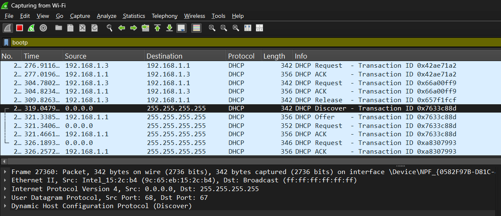
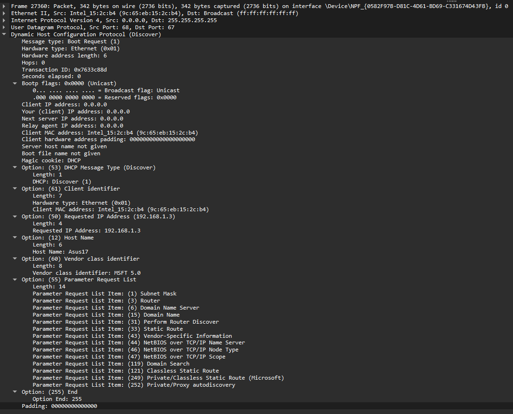
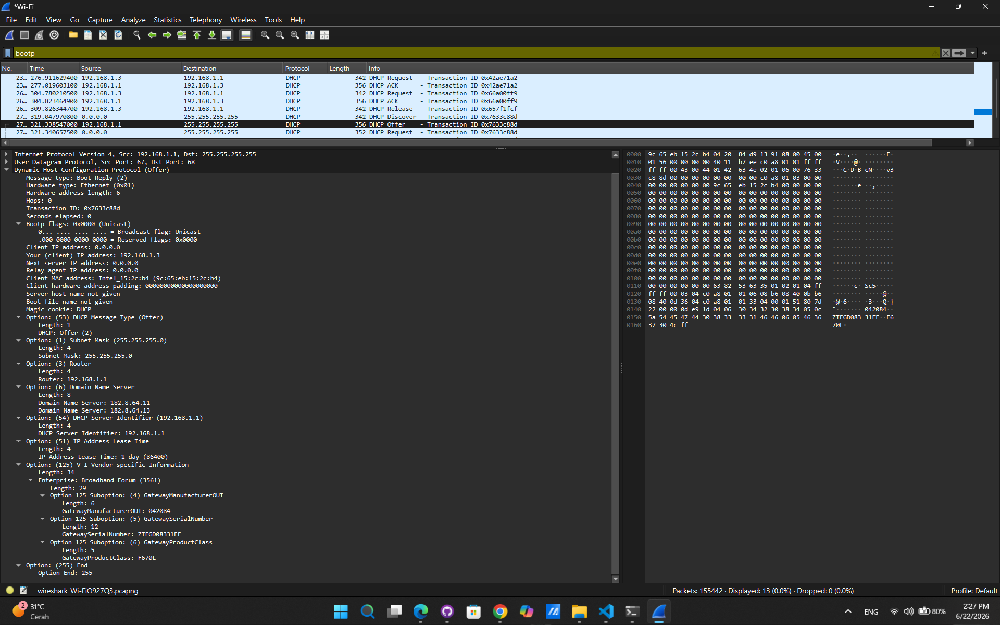
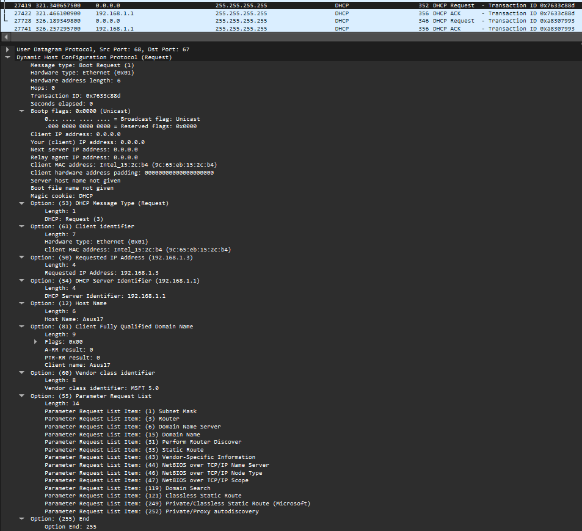
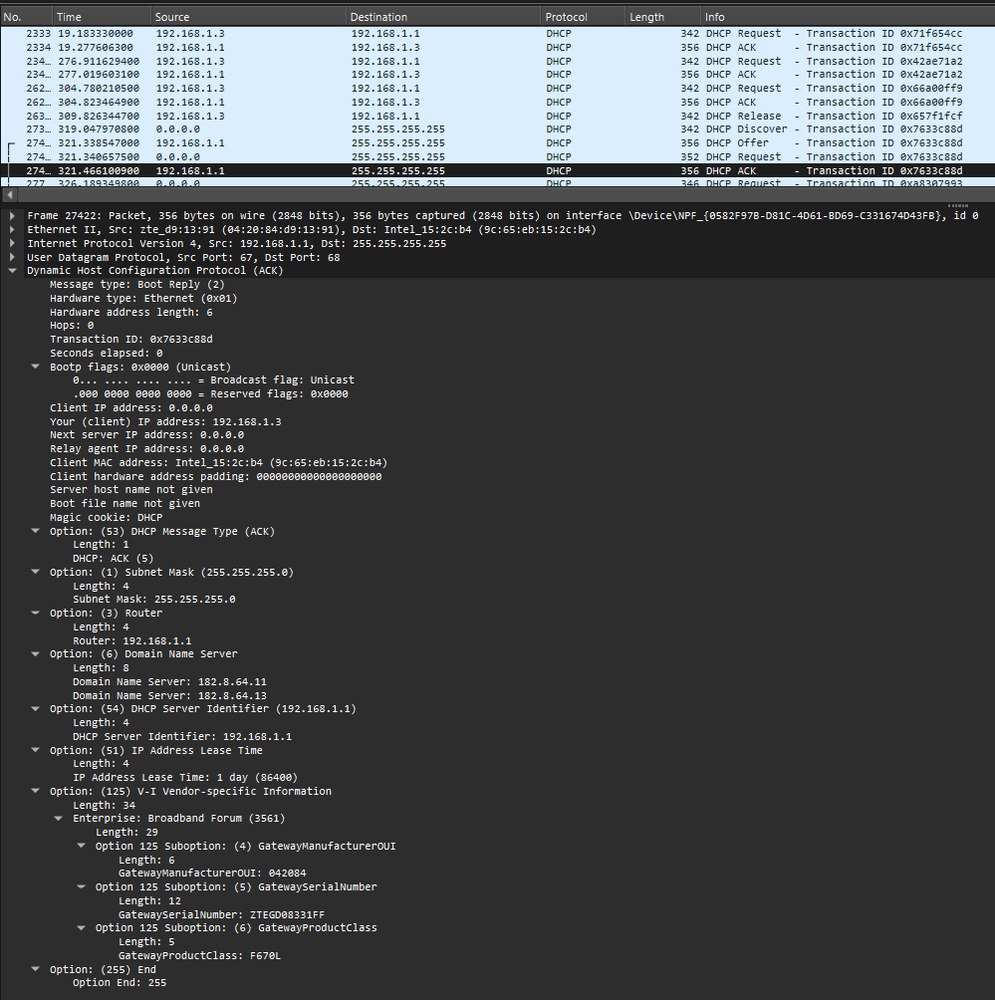

# Laporan Praktikum Jaringan Komputer - Modul 11
## Dynamic Host Configuration Protocol (DHCP)

## Identitas Praktikan

### Nama: Didit Septa Putra
### NIM: 103072400071
### Kelas: IF-04-01

---

## 1.1 Tujuan Praktikum
### 1. Menangkap dan menganalisis paket DHCP menggunakan Wireshark 
### 2. Memahami proses DORA (Discover-Offer-Request-ACK) 
### 3. Melihat konfigurasi jaringan yang diberikan DHCP server 
### 4. Mengubah tujuan praktikum menjadi tabel dalam bahasa Markdown 

---

## 1.2 Langkah Praktikum

**Yang dilakukan:**
1. Buka Command Prompt
2. Jalankan `ipconfig /release` (lepaskan IP)
3. Start Wireshark capture (pilih interface Wi-Fi)
4. Jalankan `ipconfig /renew` (minta IP baru)
5. Stop capture setelah IP muncul
6. Filter paket dengan `bootp`

## 1.3 Hasil Praktikum

### 1.3.1 Paket DHCP yang Berhasil Ditangkap

**Filter:** `bootp`



**Tabel Paket DHCP:**

| Frame | Waktu | Message Type | Source | Destination | Transaction ID |
|-------|-------|--------------|--------|-------------|----------------|
| 27360 | 319.0479... | DHCP Discover | 0.0.0.0 | 255.255.255.255 | 0x7633c88d |
| 27418 | 321.3385... | DHCP Offer | 192.168.1.1 | 255.255.255.255 | 0x7633c88d |
| 27419 | 321.3406... | DHCP Request | 0.0.0.0 | 255.255.255.255 | 0x7633c88d |
| 27422 | 321.4661... | DHCP ACK | 192.168.1.1 | 255.255.255.255 | 0x7633c88d |
| 27728 | 326.1893... | DHCP Request | 0.0.0.0 | 255.255.255.255 | 0xa8307993 |
| 27741| 326.2572... | DHCP ACK | 192.168.1.1 | 255.255.255.255 | 0xa8307993 |

**Catatan:**
- Frames 27360-27422: Proses DORA awal (saat `ipconfig /renew`)
- Frames 27728-27741: DHCP Request & ACK berikutnya (renewal)
- Transaction ID **0x7633c88d** sama untuk 4 paket pertama → satu sesi DHCP

---

### 1.3.2 DHCP Discover (Frame 83)



**Detail Paket:**
```
Message type: Boot Request (1) - Discover
Transaction ID: 0x7633c88d
Client MAC address: Intel_15:2c:b4 (9c:65:eb:15:2c:b4)
Client IP address: 0.0.0.0 (Belum punya IP)

Options:
  (53) DHCP Message Type: Discover (1)
  (61) Client identifier: Hardware type: Ethernet (0x01), MAC: 9c:65:eb:15:2c:b4
  (12) Host Name: Asus17
  (50) Requested IP Address: 192.168.1.3
  (55) Parameter Request List:
    - Subnet Mask (1)
    - Router (3)
    - Domain Name Server (6)
    - Domain Name (15)
    - Dan 10 options lainnya...
```
---

### 1.3.3 DHCP Offer (Frame 146)



**Detail Paket:**
```
Message type: Boot Reply (2) - Offer
Transaction ID: 0x7633c88d (SAMA dengan Discover!)
Your (client) IP address: 192.168.1.3
Next server IP address: 0.0.0.0
Client MAC address: Intel_15:2c:b4 (9c:65:eb:15:2c:b4)

Options:
  (53) DHCP Message Type: Offer (2)
  (54) DHCP Server Identifier: 192.168.1.1
  (51) IP Address Lease Time: 1 day (86400 seconds)
  (1) Subnet Mask: 255.255.255.0
  (3) Router: 192.168.1.1
  (6) Domain Name Server: 182.0.64.11, 182.0.64.12
```
---

### 1.3.4 DHCP Request (Frame 147)



**Detail Paket:**
```
Message type: Boot Request (3) - Request
Transaction ID: 0x7633c88d
Client MAC address: Intel_15:2c:b4 (9c:65:eb:15:2c:b4)

Options:
  (53) DHCP Message Type: Request (3)
  (50) Requested IP Address: 192.168.1.3
  (54) DHCP Server Identifier: 192.168.1.1
  (12) Host Name: Asus17
  (55) Parameter Request List:
    - Subnet Mask, Router, DNS, Domain Name, dll.
```

**Yang dilakukan client:**
- Menerima tawaran server
- Request IP **192.168.1.3** secara formal
- Pilih server **192.168.1.1**

---

### 1.3.5 DHCP ACK (Frame 148)



**Detail Paket:**
```
Message type: Boot Reply (5) - ACK
Transaction ID: 0x7633c88d
Your (client) IP address: 192.168.1.3
Next server IP address: 0.0.0.0

Options:
  (53) DHCP Message Type: ACK (5)
  (54) DHCP Server Identifier: 192.168.1.1
  (51) IP Address Lease Time: 1 day (86400 seconds)
  (1) Subnet Mask: 255.255.255.0
  (3) Router: 192.168.1.1
  (6) Domain Name Server: 182.0.64.11, 182.0.64.12
```

**Catatan menarik:**
- Offer: Lease time 1 hari
- ACK: Lease time 1 hari
- Server konsisten memberikan lease time yang sama sebesar 1 hari dari awal penawaran hingga finalisasi
---

### 1.3.6 DHCP Renewal (Frames 401 & 403)

**Frame 27728 - DHCP Request:**
```
Source: 0.0.0.0
Destination: 255.255.255.255 (broadcast)
Transaction ID: 0xa8307993 (ID baru)
Message Type: Request
```

**Frame 27741 - DHCP ACK:**
```
Source: 192.168.1.1
Destination: 255.255.255.255 (broadcast)
Transaction ID: 0xa8307993
Message Type: ACK
```

---

## 1.4 Analisis Praktikum

### 1.4.1 Proses DORA yang Teramati

```
Waktu 319.04s : Client kirim DHCP Discover (broadcast)
Waktu 321.33s : Server balas DHCP Offer (broadcast)
Waktu 321.34s : Client kirim DHCP Request (broadcast)
Waktu 321.46s : Server kirim DHCP ACK (broadcast)
─────────────────────────────────────────────────────
Total waktu : ~2.42 detik (dari Discover ke ACK)

Waktu 326.18s : Client kirim DHCP Request (broadcast)
Waktu 326.25s : Server balas DHCP ACK (broadcast)
─────────────────────────────────────────────────────
Renewal time : ~0.07 detik (lebih cepat!)
```

**Perbedaan:**
- Initial DORA: Broadcast, butuh 4 paket, ~2.42 detik
- Renewal: Broadcast, cuma 2 paket (Request+ACK), ~0.07 detik

---

### 1.4.2 Konfigurasi Jaringan yang Diberikan

| Parameter | Nilai | Keterangan |
|-----------|-------|------------|
| **IP Address** | 192.168.1.3 | Alamat client |
| **Subnet Mask** | 255.255.255.0 | Network /24 |
| **Default Gateway** | 192.168.1.1 | Router untuk internet |
| **DNS Server** | 182.0.64.11, 182.0.64.12 | DNS resolver |
| **Lease Time** | 1 hari (86400s)) | Masa berlaku IP |
| **DHCP Server** | 192.168.1.1 | Server yang memberi IP |

---

### 1.4.4 Broadcast vs Unicast

**Initial DORA (Broadcast):**
```
Frame 27360 (Discover): Transaction ID = 0x7633c88d
Frame 27418 (Offer)    : Transaction ID = 0x7633c88d (broadcast)
Frame 27419 (Request)  : Transaction ID = 0x7633c88d (broadcast)
Frame 27422 (ACK)      : Transaction ID = 0x7633c88d (broadcast)
```

**Renewal (Unicast):**
```
Frame 27728 (Request): Transaction ID = 0xa8307993 (unicast)
Frame 27741 (ACK)      : Transaction ID = 0xa8307993 (unicast)
```

---

### 1.4.5 Lease Time Analysis

**Dari Wireshark:**
- Offer: Lease time = 86400 seconds (1 hari)
- ACK: Lease time = 86400 seconds (1 hari)

---

### 1.5 Kesimpulan

#### A. Poin-Poin Keberhasilan Praktikum


| No. | Aspek Analisis | Hasil yang Berhasil Dilakukan |
| :---: | :--- | :--- |
| **1** | **Penangkapan Paket** | Berhasil menangkap 4 paket DHCP utama (Discover, Offer, Request, ACK) ditambah 2 paket renewal. |
| **2** | **Proses DORA** | Berjalan lengkap:<br>• **Discover**: Client mencari server (broadcast)<br>• **Offer**: Server menawarkan IP `192.168.1.3`<br>• **Request**: Client meminta IP tersebut<br>• **ACK**: Server konfirmasi, client resmi mendapat IP. |
| **3** | **Transaction ID** | Konsisten menggunakan ID `0x7633c88d` untuk seluruh sesi initial DORA. |
| **4** | **Konfigurasi Jaringan** | Berhasil mendapatkan parameter:<br>• **IP**: `192.168.1.3`<br>• **Subnet Mask**: `255.255.255.0`<br>• **Gateway**: `192.168.1.1`<br>• **DNS**: `182.0.64.11 & 182.0.64.12`<br>• **Lease Time**: 1 hari. |
| **5** | **Metode Pengiriman** | Terlihat perbedaan jelas:<br>• **Initial DORA**: Menggunakan *broadcast* (karena client belum punya IP)<br>• **Renewal**: Menggunakan *unicast* (lebih cepat & efisien). |
| **6** | **Efektivitas Alat** | Wireshark terbukti efektif untuk analisis protokol DHCP menggunakan filter `bootp`. |

#### B. Temuan Menarik Selama Praktikum


| No. | Objek Temuan | Deskripsi Analisis Temuan |
| :---: | :--- | :--- |
| **1** | **Lease Time** | Durasi sewa IP bersifat sangat konsisten sejak awal penawaran hingga finalisasi, di mana pada paket Offer dan paket ACK sama-sama menunjukkan waktu 1 hari (86400 detik) tanpa adanya penyesuaian di tengah proses. |
| **2** | **Kecepatan Proses** | Proses *Renewal* berjalan jauh lebih cepat (`0.07s`) dibandingkan proses DORA awal (`2.42s`) karena langsung menggunakan jalur *unicast*. |
| **3** | **Infrastruktur Jaringan** | Alamat *Gateway* dan *DNS* menggunakan IP yang sama (`192.168.1.1`), menunjukkan satu perangkat multifungsi (router). |