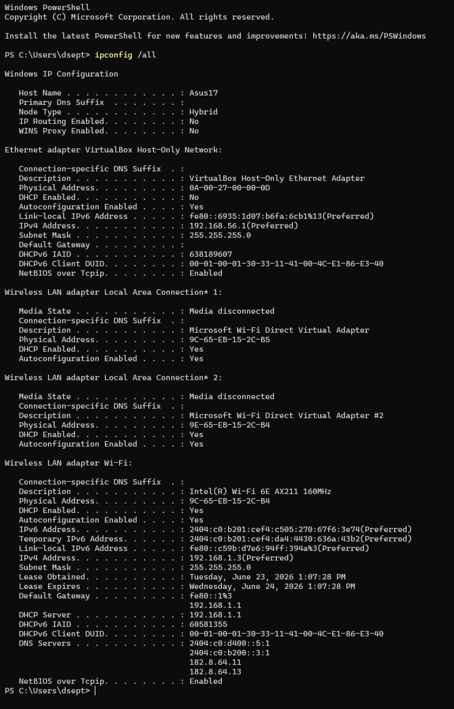
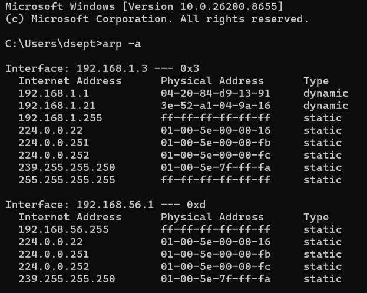
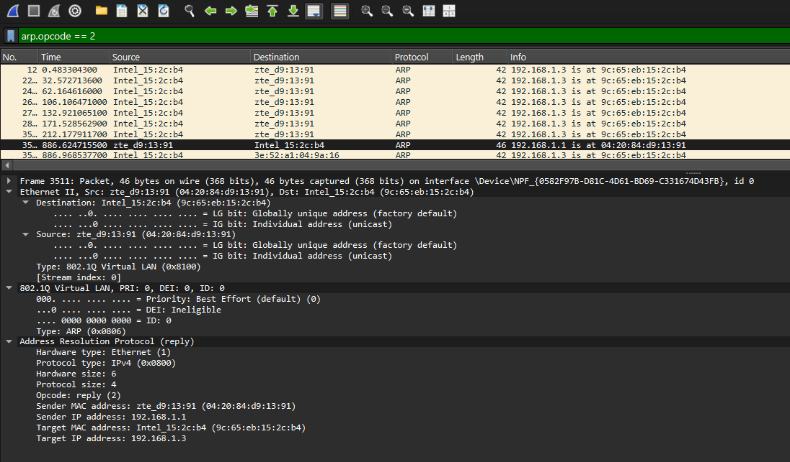
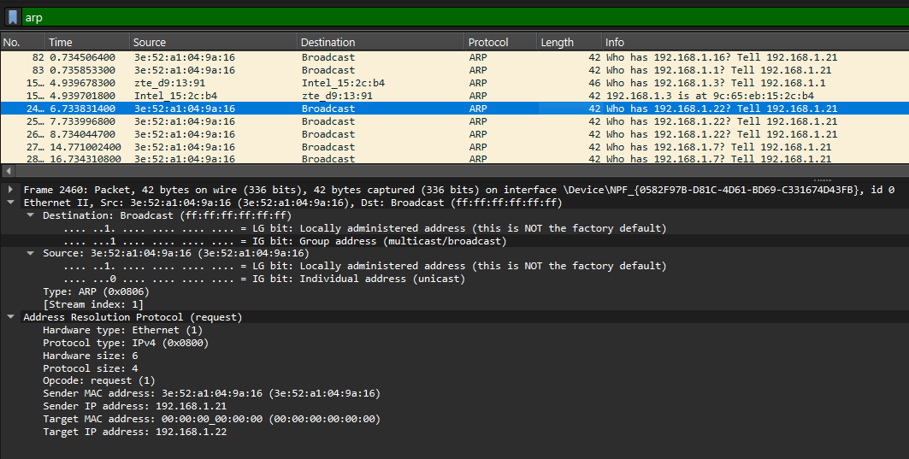
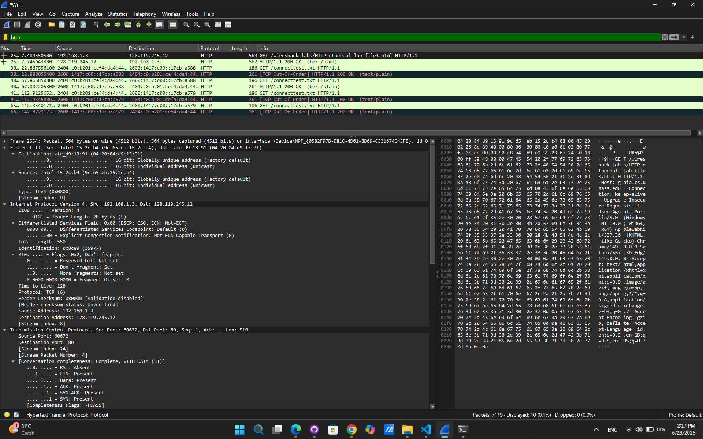
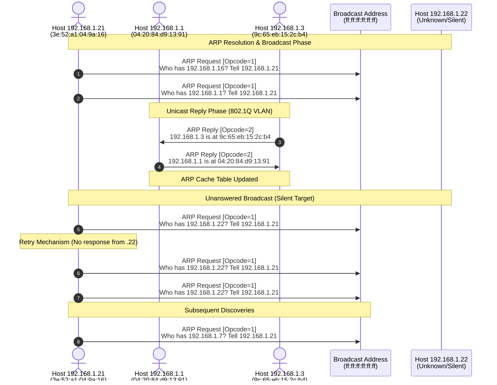

# Laporan Praktikum Jaringan Komputer - Modul 13

## Identitas Praktikan
### Nama: Didit Septa Putra
### NIM: 103072400071
### Kelas: IF-04-01
---

## 1. Tujuan Praktikum

Berdasarkan modul praktikum Jaringan Komputer Semester Genap 2025/2026, tujuan dari Modul 13 adalah:
### 1. Mahasiswa dapat menginvestigasi cara kerja Ethernet dan ARP menggunakan Wireshark
### 2 Mahasiswa mampu menganalisis struktur frame Ethernet
### 3. Mahasiswa memahami mekanisme Address Resolution Protocol (ARP)
### 4 Mahasiswa dapat menganalisis cache ARP dan proses resolusi alamat

---

## 2. Langkah Kerja

Berikut adalah langkah-langkah yang dilakukan selama praktikum Modul 13:

### 2.1 Persiapan dan Capture Frame Ethernet

1. Membersihkan cache browser
2. Membuka Wireshark dan memulai packet capture
3. Mengakses URL: `http://gaia.cs.umass.edu/wireshark-labs/HTTP-ethereal-lab-file3.html`
4. Browser menampilkan dokumen "Bill of Rights AS"
5. Menghentikan capture dan menganalisis frame Ethernet

### 2.2 Analisis ARP Cache

1. Melihat isi ARP cache menggunakan perintah:
   **Windows**: `arp -a` di command prompt
2. Mengamati entry dynamic dan static dalam ARP cache
3. Mengidentifikasi interface network yang aktif

### 2.3 Mengamati Aksi ARP

1. Membersihkan cache ARP dan cache browser
2. Memulai Wireshark capture
3. Mengakses URL yang sama
4. Menganalisis paket ARP Request dan ARP Reply
5. Menggunakan filter `arp.opcode == 2` untuk melihat ARP Reply
6. Menggunakan filter `arp` untuk melihat semua traffic ARP

---

## 3. Hasil dan Pembahasan

### 3.1 Konfigurasi Network Interface



*Gambar 1: Output ipconfig /all menunjukkan konfigurasi network adapter*

#### Informasi Network Interface

| Parameter | Nilai |
|-----------|-------|
| **Host Name** | ASUS17 |
| **Adapter** | Intel(R) Wi-Fi 6E AX211 160MHz |
| **Physical Address (MAC)** | 9C-65-EB-15-2C-B4 |
| **IPv4 Address** | 192.168.1.3 |
| **Subnet Mask** | 255.255.255.0 |
| **Default Gateway** | 192.168.1.1|
| **DHCP Server** | 192.168.1.1 |
| **DNS Server** | 182.8.64.11 |
| **Lease Obtained** | Tuesday, June 23, 2026 1:07:28 PM |
| **Lease Expires** | Wednesday, June 24, 2026 1:07:28 PM |

### 3.2 ARP Cache Analysis



*Gambar 2: Output perintah arp -a menunjukkan ARP cache table*

#### ARP Cache Table

| Internet Address | Physical Address | Type |
|-----------------|------------------|------|
| 192.168.1.1 | 04-20-84-d9-13-91 | dynamic |
| 192.168.1.21 | 3e-52-a1-04-9a-16 | dynamic |
| 192.168.1.255 | ff-ff-ff-ff-ff-ff | static |
| 224.0.0.22 | 01-00-5e-00-00-16 | static |
| 224.0.0.251 | 01-00-5e-00-00-fb | static |
| 224.0.0.252 | 01-00-5e-00-00-fc | static |
| 239.255.255.250 | 01-00-5e-7f-ff-fa | static |
| 255.255.255.255 | ff-ff-ff-ff-ff-ff | static |

**Penjelasan:**
- **Dynamic entries**: Entry yang dipelajari secara otomatis melalui ARP protocol (192.168.1.1, 192.168.1.21)
- **Static entries**: Entry yang sudah ada secara permanen, biasanya untuk broadcast dan multicast addresses
- Interface yang aktif: 192.168.1.3 dengan identifier 0x3

### 3.3 Analisis ARP Reply



*Gambar 3: Detail ARP Reply packet (Frame 3511)*

#### ARP Reply Structure (Frame 3511)

| Field | Nilai | Keterangan |
|-------|-------|-----------|
| **Frame Number** | 3511 |
| **Time** | 886.624715500 detik |
| **Source MAC** | 04:20:84:d9:13:91 (zte_d9:13:91) | MAC address pengirim reply |
| **Destination MAC** | 9c:65:eb:15:2c:b4 (Intel_15:2c:b4) | MAC address tujuan |
| **Type** | 802.1Q Virtual LAN (0x8100) | VLAN tagging |
| **Protocol** | ARP (0x0806) |
| **Hardware Type** | Ethernet (1) |
| **Protocol Type** | IPv4 (0x0800) |
| **Opcode** | reply (2) | ARP Reply |
| **Sender MAC** | 04:20:84:d9:13:91 |
| **Sender IP** | 192.168.1.1 |
| **Target MAC** | 9c:65:eb:15:2c:b4 |
| **Target IP** | 192.168.1.3 |

#### Detail Ethernet Header

```
Ethernet II, Src: zte_d9:13:91 (04:20:84:d9:13:91), Dst: Intel_15:2c:b4 (9c:65:eb:15:2c:b4)
    Destination: Intel_15:2c:b4 (9c:65:eb:15:2c:b4)
        .... ..0. .... .... .... .... = LG bit: Globally unique address (factory default)
        .... ...0 .... .... .... .... = IG bit: Individual address (unicast)
    Source: zte_d9:13:91 (04:20:84:d9:13:91)
        .... ..0. .... .... .... .... = LG bit: Globally unique address (factory default)
        .... ...0 .... .... .... .... = IG bit: Individual address (unicast)
    Type: 802.1Q Virtual LAN (0x8100)
    802.1Q Virtual LAN, PRI: 0, DEI: 0, ID: 0
        000. .... .... .... = Priority: Best Effort (default) (0)
        ...0 .... .... .... = DEI: Ineligible
        .... 0000 0000 0000 = ID: 0
    Type: ARP (0x0806)

```
   **Penjelasan:**

- ARP Reply dikirim sebagai unicast ke requesting host
- Sender (192.168.1.1) memberikan MAC address-nya (04:20:84:d9:13:91) kepada target (192.168.1.3)
- Menggunakan VLAN tagging (802.1Q)
- Source MAC menggunakan globally unique address (factory default)

### 3.4 Analisis ARP Request



*Gambar 4: Multiple ARP Requests (Frame 2460)*

#### ARP Request Structure (Frame 2460)

| Field | Nilai | Keterangan |
|-------|-------|-----------|
| **Frame Number** | 2460 |
| **Source MAC** | 3e:52:a1:04:9a:16 |
| **Destination** | Broadcast (ff:ff:ff:ff:ff:ff) |
| **Type** | ARP (0x0806) |
| **Hardware Type** | Ethernet (1) |
| **Protocol Type** | IPv4 (0x0800) |
| **Opcode** | request (1) |
| **Sender MAC** | 3e:52:a1:04:9a:16 |
| **Sender IP** | 192.168.1.21 |
| **Target MAC** | 00:00:00:00:00:00 (kosong) |
| **Target IP** | 192.168.1.22 |

#### Detail Packet

```
Ethernet II, Src: 3e:52:a1:04:9a:16 (3e:52:a1:04:9a:16), Dst: Broadcast (ff:ff:ff:ff:ff:ff)
    Destination: Broadcast (ff:ff:ff:ff:ff:ff)
        .... ..1. .... .... .... .... = LG bit: Locally administered address (this is NOT the factory default)
        .... ...1 .... .... .... .... = IG bit: Group address (multicast/broadcast)
    Source: 3e:52:a1:04:9a:16 (3e:52:a1:04:9a:16)
        .... ..1. .... .... .... .... = LG bit: Locally administered address (this is NOT the factory default)
        .... ...0 .... .... .... .... = IG bit: Individual address (unicast)
    Type: ARP (0x0806)

Address Resolution Protocol (request)
    Hardware type: Ethernet (1)
    Protocol type: IPv4 (0x0800)
    Hardware size: 6
    Protocol size: 4
    Opcode: request (1)
    Sender MAC address: 3e:52:a1:04:9a:16 (3e:52:a1:04:9a:16)
    Sender IP address: 192.168.1.21
    Target MAC address: 00:00:00:00:00:00 (00:00:00:00:00:00)
    Target IP address: 192.168.1.22
```
**Penjelasan:**

- ARP Request dikirim secara broadcast (ff:ff:ff:ff:ff:ff)
- Sender (192.168.1.21) menanyakan "Who has 192.168.1.22?"
- Target MAC diisi dengan 00:00:00:00:00:00 karena belum diketahui
- Device dengan IP 192.168.1.22 akan merespons dengan ARP Reply

#### Traffic Pattern ARP Requests

Dari packet list terlihat multiple ARP requests:

| Frame No. | Source | Destination | Info |
|-----------|--------|-------------|------|
| 82 | 3e:52:a1:04:9a:16 | Broadcast | Who has 192.168.1.16? Tell 192.168.1.21 |
| 83 | 3e:52:a1:04:9a:16 | Broadcast | Who has 192.168.1.1? Tell 192.168.1.21 |
| 2460 | 3e:52:a1:04:9a:16 | Broadcast | Who has 192.168.1.22? Tell 192.168.1.21 |
| 2560 | 3e:52:a1:04:9a:16 | Broadcast | Who has 192.168.1.22? Tell 192.168.1.21 |
| 2660 | I3e:52:a1:04:9a:16 | Broadcast | Who has 192.168.1.7? Tell 192.168.1.21 |

**Pattern Analysis:**
- ARP requests diulang berkali-kali (retransmission)
- Satu device aktif melakukan scanning/pencarian ARP secara masif, yaitu host dengan IP 192.168.1.21.
- Target yang dicari di dalam jaringan lokal ini mencakup IP 192.168.1.16, 192.168.1.1, 192.168.1.22, dan 192.168.1.7.

### 3.5 Analisis HTTP over Ethernet



*Gambar 5: HTTP GET Request (Frame 2554)*

#### Informasi Paket HTTP

| Field | Nilai |
|-------|-------|
| **Frame Number** | 2554 |
| **Time** | 7.484558500 detik |
| **Source IP** | 192.168.1.3 |
| **Destination IP** | 128.119.245.12 (gaia.cs.umass.edu) |
| **Source MAC** | Intel_15:2c:b4 (9c:65:f8:15:2c:b4) |
| **Destination MAC** | zte_d9:13:91 (04:20:84:d9:13:91) |
| **Protocol** | HTTP |
| **Request** | GET /wireshark-labs/HTTP-wireshark-file3.html HTTP/1.1 |
| **Response** | HTTP/1.1 200 OK (text/html) (terlihat pada Frame 26..) |

#### Stack Protokol

```
Frame 2554: 564 bytes on wire (4512 bits), 564 bytes captured (4512 bits)
├── Ethernet II (Layer 2)
│   ├── Destination: zte_d9:13:91 (04:20:84:d9:13:91)
│   ├── Source: Intel_15:2c:b4 (9c:65:f8:15:2c:b4)
│   └── Type: IPv4 (0x0800)
├── Internet Protocol Version 4 (Layer 3)
│   ├── Version: 4
│   ├── Header Length: 20 bytes (5)
│   ├── Differentiated Services Field: 0x00 (DSCP: CS0, ECN: Not-ECT)
│   ├── Total Length: 550
│   ├── Identification: 0x8c89 (35977)
│   ├── Flags: 0x02, Don't fragment
│   ├── Time to Live: 128
│   ├── Protocol: TCP (6)
│   ├── Source Address: 192.168.1.3
│   └── Destination Address: 128.119.245.12
├── Transmission Control Protocol (Layer 4)
│   ├── Source Port: 60672
│   ├── Destination Port: 80 (HTTP)
│   ├── Seq: 1, Ack: 1, Len: 510
│   └── [Stream index: 24]
└── Hypertext Transfer Protocol (Layer 7)
├── GET /wireshark-labs/HTTP-ethereal-lab-file3.html HTTP/1.1
├── Host: gaia.cs.umass.edu (terlihat pada potongan data hex/ASCII di kanan)
└── [Response: HTTP/1.1 200 OK] (terlihat pada Frame 26..)
```

#### Detail IP Header

```
   Internet Protocol Version 4, Src: 192.168.1.3, Dst: 128.119.245.12
   0100 .... = Version: 4
   .... 0101 = Header Length: 20 bytes (5)
   Differentiated Services Field: 0x00 (DSCP: CS0, ECN: Not-ECT)
   0000 00.. = Differentiated Services Codepoint: Default (0)
   .... ..00 = Explicit Congestion Notification: Not-ECN-Capable Transport (0)
   Total Length: 550
   Identification: 0x8c89 (35977)
   Flags: 0x02, Don't fragment
   0... .... = Reserved bit: Not set
   .1.. .... = Don't fragment: Set
   ..0. .... = More fragments: Not set
   ...0 0000 0000 0000 = Fragment Offset: 0
   Time to Live: 128
   Protocol: TCP (6)
   Header Checksum: 0x0000 [validation disabled]
   Source Address: 192.168.1.3
   Destination Address: 128.119.245.12
```

**Penjelasan:**
- HTTP GET request dikirim dari client (192.168.1.3) ke server gaia.cs.umass.edu (128.119.245.12)
- Server kemudian memberikan respons balasan yang memuat status HTTP 200 OK, menandakan bahwa request berhasil diproses dan dokumen HTML yang diminta ditransfer sepenuhnya dalam keadaan baru
- TTL (Time to Live): 128 hops
- TCP segment dengan source port 53475 ke destination port 80 (HTTP)
- Payload size: 510 bytes

### 3.6 Perbandingan ARP Request dan ARP Reply

| Aspek | ARP Request | ARP Reply |
|-------|-------------|-----------|
| **Opcode** | 1 (request) | 2 (reply) |
| **Destination MAC** | Broadcast (ff:ff:ff:ff:ff:ff) | Unicast (specific MAC) |
| **Target MAC** | 00:00:00:00:00:00 (kosong) | Diisi dengan MAC address |
| **Direction** | Satu ke banyak (broadcast) | Point-to-point (unicast) |
| **Purpose** | Mencari owner IP address | Memberikan informasi MAC address |

### 3.7 Analisis Traffic Pattern



### 3.8 Struktur Frame Ethernet

#### Ethernet Frame dengan VLAN Tagging (802.1Q)

```
+---------------------+---------------------+---------------------+
| Dest MAC            | Source MAC          | Type                |
| Intel_15:2c:b4      | zte_d9:13:91        | 0x8100 (802.1Q)     |
| (9c:65:eb:15:2c:b4) | (04:20:84:d9:13:91) |                     |
+-----------------------------------------------------------------+
| 802.1Q Tag (4 bytes)                                            |
| PRI: 0 (Best Effort), DEI: 0 (Ineligible), VLAN ID: 0           |
+-----------------------------------------------------------------+
| EtherType: 0x0806 (ARP)                                         |
+-----------------------------------------------------------------+
| Payload (46 bytes)                                              |
| -> ARP Reply (Opcode 2)                                         |
+-----------------------------------------------------------------+
| Frame Check Sequence (FCS)                                      |
| (4 bytes)                                                       |
+-----------------------------------------------------------------+
```

### 3.9 Kesimpulan Praktikum

Berdasarkan praktikum dan analisis paket data (*packet sniffing*) yang telah dilakukan menggunakan Wireshark, dapat disimpulkan beberapa poin utama sebagai berikut:

**1. Konfigurasi Network Interface & Host Terdeteksi**
- **Host Pengirim Utama (Request):** Menggunakan perangkat dengan MAC Address `3e:52:a1:04:9a:16` dan IPv4 Address `192.168.1.21`.
- **Host Gateway/Target Terdeteksi:** * Host `192.168.1.1` menggunakan perangkat dengan vendor **ZTE** (MAC: `04:20:84:d9:13:91`).
  * Host `192.168.1.3` menggunakan perangkat dengan vendor **Intel** (MAC: `9c:65:eb:15:2c:b4`).

**2. ARP Cache Management & Traffic Behavior**
- Tabel *ARP Cache* diperbarui secara dinamis setelah terjadinya proses pencarian alamat.
- Terdapat mekanisme *retry* (pengulangan) otomatis pada jaringan jika target *host* tidak merespons, seperti pencarian terhadap IP `192.168.1.22` oleh Host `.21` yang dilakukan sebanyak 3 kali berturut-turut tanpa mendapatkan jawaban (*silent target*).

**3. Karakteristik ARP Request dan Reply**
- **ARP Request:** Dikirim menggunakan alamat tujuan *Layer 2* berupa **Broadcast** (`ff:ff:ff:ff:ff:ff`) ke seluruh jaringan lokal, menggunakan **Opcode: 1**, dan menyetel *Target MAC address* kosong secara terstruktur (`00:00:00:00:00:00`).
- **ARP Reply:** Dikirim secara langsung (**Unicast**) menuju perangkat peminta (*requesting host*), menggunakan **Opcode: 2**, dan telah menyertakan alamat MAC fisik yang valid dari *host* tujuan.

**4. Enkapsulasi VLAN Tagging (IEEE 802.1Q)**
- Paket respons (*ARP Reply*) pada jaringan ini terbukti menggunakan mekanisme **VLAN Tagging (802.1Q)** dengan menyisipkan *header* tambahan berukuran **4 bytes** pada Ethernet frame standar.
- Parameter penandaan VLAN yang tertangkap menunjukkan nilai **PRI: 0** (*Best Effort*), **DEI: 0** (*Ineligible* untuk di-drop), dan **VLAN ID: 0** (Membawa informasi prioritas lokal tanpa keanggotaan VLAN spesifik).

**5. Protokol Transport & Aplikasi (No HTTP Traffic)**
- Seluruh aktivitas tangkapan layar murni mendokumentasikan lalu lintas *Layer 2* (ARP) dan struktur pembungkus jaringan lokal (802.1Q Virtual LAN). Tidak ditemukan adanya segmen TCP maupun *payload* protokol aplikasi berbasis **HTTP (Port 80)** pada sesi pengamatan ini.

**6. Identifikasi Tipe MAC Address via Bit Khusus**
- **Individual Address (Unicast):** Diidentifikasi melalui nilai bit **I/G (Individual/Group) = 0** (seperti yang terlihat pada struktur *Source MAC* milik perangkat pengirim).
- **Group Address (Multicast/Broadcast):** Diidentifikasi melalui nilai bit **I/G (Individual/Group) = 1** (seperti yang terlihat pada alamat tujuan `ff:ff:ff:ff:ff:ff`).
- **Locally Administered Address:** Ditandai dengan bit **L/G (Local/Global) = 1**, menunjukkan alamat tersebut dikonfigurasi secara lokal (bukan bawaan pabrik/*factory default* seperti pada perangkat pengirim `3e:52:a1...`).
- **Globally Unique Address:** Ditandai dengan bit **L/G (Local/Global) = 0**, menandakan alamat fisik asli bawaan pabrik (seperti pada vendor ZTE dan Intel).

---

### 4 Network Information

Analisis komponen parameter jaringan dan entri log data yang aktif selama proses pengamatan adalah sebagai berikut:

**Interface yang Aktif:**
- **Nama Interface:** `\Device\NPF_{0582F97B-D81C-4D61-BD69-C331674043FB}` (ID: 0)
- **IP Host Pengamat:** `192.168.1.21`

**ARP Cache Entries & Hosts Terkait:**
- **Dynamic Entries:** Terdeteksi interaksi aktif dari IP `192.168.1.1` (ZTE Device) dan `192.168.1.3` (Intel Device).
- **Static Entries:** Terbaca alamat *layer 2* bertipe *Broadcast* (`ff:ff:ff:ff:ff:ff`) untuk penyebaran paket permintaan.

**Traffic yang Dianalisis:**
- **ARP Requests:** Terjadi pencarian berulang (*multiple requests*) secara masif untuk target IP `192.168.1.22`, serta pencarian tunggal untuk IP `192.168.1.16` dan `192.168.1.7`.
- **ARP Reply:** Terkonfirmasi respons valid bahwa IP `192.168.1.3` berada di alamat `9c:65:eb:15:2c:b4` serta IP `192.168.1.1` berada di alamat `04:20:84:d9:13:91`.
- **HTTP Traffic:** Tidak ditemukan adanya trafik HTTP (`GET request`) maupun protokol *layer* atas lainnya pada paket yang dianalisis; seluruh trafik berfokus pada manajemen alamat di *Layer 2*.