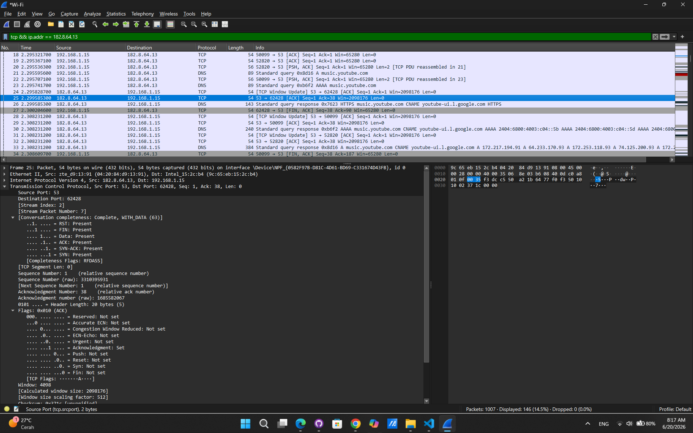

# Laporan Praktikum Jaringan Komputer - Modul 6
## Transmission Control Protocol (TCP) Analysis

## Identitas Praktikan
### **Nama** Didit Septa Putra
### **NIM** 103072400071
### **Kelas** IF-04-01

---

## 1. Tujuan Praktikum

### 1. Analisis cara kerja TCP: Mengerti bagaimana TCP kirim data dengan jaminan sampai 
### 2. Identifikasi sequence & acknowledgment: Paham cara TCP lacak data yang dikirim dan diterima
### 3. Amati congestion control: Melihat bagaimana TCP atur kecepatan kirim agar tidak macet
### 4. Hitung throughput & RTT: Bisa ukur kecepatan dan delay koneksi TCP

---

## 2. Langkah Kerja

| No | Tahap | Aktivitas | Tujuan |
|----|-------|-----------|--------|
| 1 | Persiapan | Download alice.txt | File referensi |
| 2 | Buka halaman | Akses TCP-wireshark-file1 | Halaman upload |
| 3 | Start capture | Wireshark + filter TCP | Rekam traffic |
| 4 | Generate traffic | Upload alice.txt via browser | Buat data TCP |
| 5 | Stop capture | Klik Stop di Wireshark | Selesai rekam |
| 6 | Analisis | Statistics → TCP Graphs | Insight data |

---

## 3. Hasil Praktikum

### 3.1 Identitas Koneksi

| Parameter | Nilai |
|-----------|-------|
| Client IP | 192.168.1.15|
| Client Port | 62428 |
| Server IP | 182.8.64.13 |
| Server Port | 53 (DNS / TCP) |
| Protocol | TCP |
| Application | DNS over TCP |