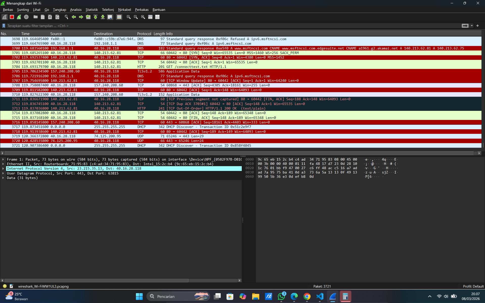
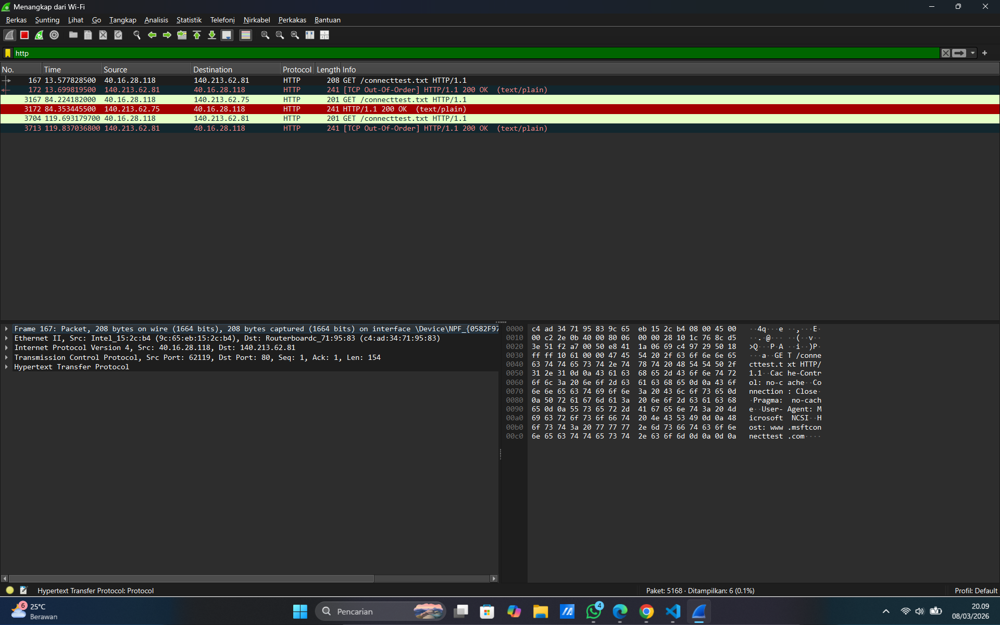

#LAPORAN PRAKTIKUM IF-04-01

##TUJUAN PRAKTIKUM
Mempelajari Wireshark

##LANGKAH AWAL
1. Download ISO Wireshark https://www.wireshark.org/
2. Install sampai selesai

##PRAKTIK MENGGUNAKAN WIRESHARK
1. Buka APK yang sudah di unduh
2. Hubungkan Perangkat ke Wifi
3. Lalu klik bagian wifi
4. Disana terlihat trafik paket jaringan dengan detail seperti alamat IP,protokol,waktu,panjang,info.
5. Lalu jalankan di browser http://gaia.cs.umass.edu/wireshark-labs/INTRO-wireshark-file1.html
6. pastikan link tersebut HTTP bukan HTTPS
7. lalu Pause
8. ketik HTTP di pencarian Wireshark
9. jika berhasi disitu akan muncul link yang dijalankan di browser tadi.

##LAMPIRAN
Hasil Percobaan: 

