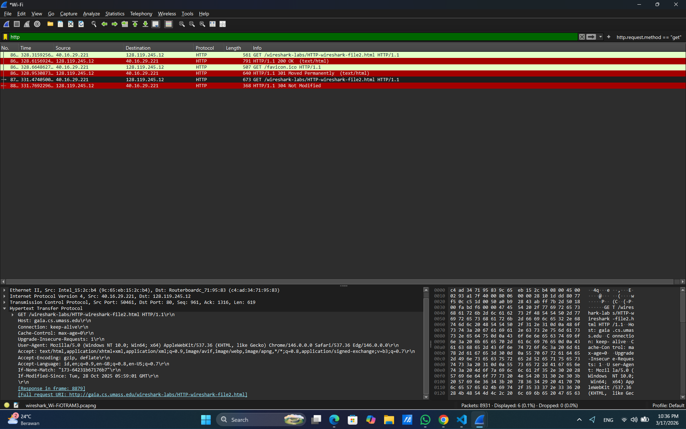
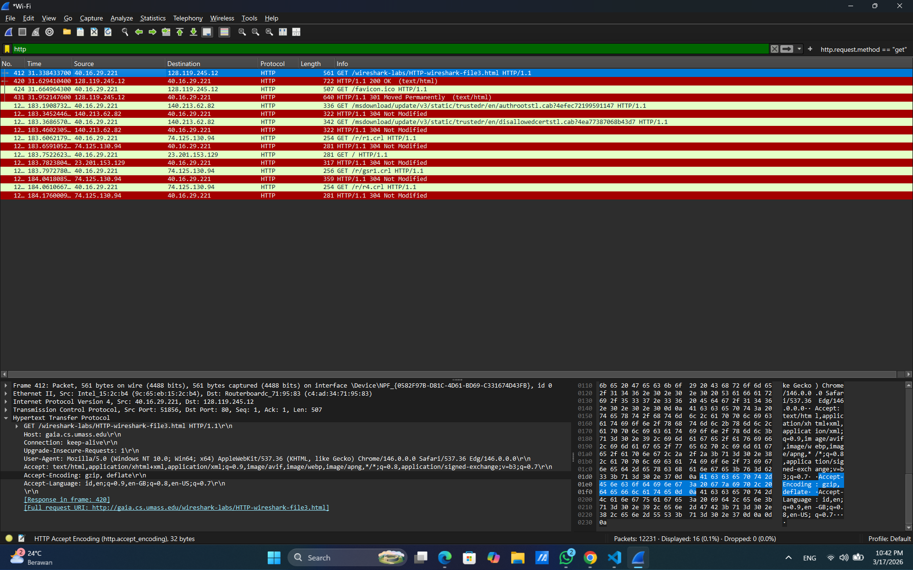
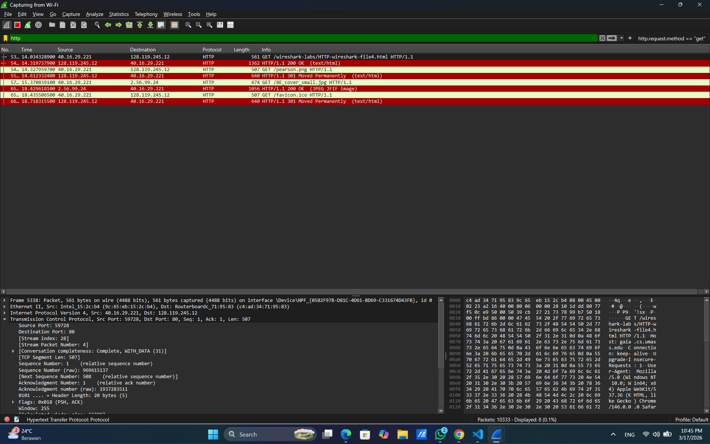
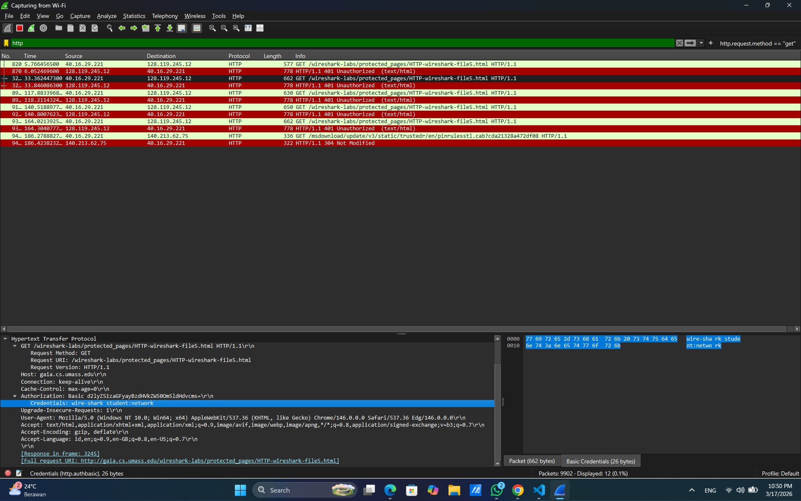

# Laporan Praktikum Jaringan Komputer
## Modul 3: HTTP

**Nama:** Didit Septa Putra
**NIM:** 103072400071
**Kelas:** IF-04-01   

---

#### 3.1 Basic HTTP GET/response interaction
**Tujuan:** Mengunduh file HTML sederhana yang sangat pendek dan tidak berisi objek yang disematkan.

**Bukti *Screenshot* Wireshark:**
> **

**Analisis:**
Ketika browser meminta file1.html, terjadi pertukaran pesan sederhana: klien mengirim permintaan HTTP GET tunggal ke server (gaia.cs.umass.edu), dan server membalas dengan respons HTTP 200 OK. Respons server ini langsung menyertakan isi teks file HTML tersebut dalam paketnya. Proses tersebut menggambarkan interaksi dasar yang lancar tanpa hambatan atau fragmentasi, berkat ukuran file yang sangat kecil.

#### 3.2 HTTP CONDITIONAL GET/response interaction
**Tujuan:** Melakukan GET bersyarat saat mengambil objek HTTP yang dipengaruhi oleh aktivitas *caching* pada *browser web*.

**Bukti *Screenshot* Wireshark:**
> **

**Analisis:**
Dalam percobaan ini, karena browser telah menyimpan cache dari akses sebelumnya, browser mengirimkan permintaan GET bersyarat yang menyertakan header If-Modified-Since. Server memeriksa apakah file telah diubah sejak waktu yang ditentukan. Jika tidak ada perubahan, server menghindari pemborosan bandwidth dengan tidak mengirim ulang isi file, melainkan hanya merespons dengan status 304 Not Modified.

#### 3.3 Retrieving Long Documents
**Tujuan:** Mengamati perilaku HTTP saat mengunduh dokumen file HTML yang berukuran cukup panjang (sekitar 4500 byte), yang melebihi batas ukuran satu paket TCP.

**Bukti *Screenshot* Wireshark:**
> **

**Analisis:**
Dalam percobaan ini, keterangan [TCP segment of a reassembled PDU] tidak muncul, dan paket respons HTTP 200 OK hanya berukuran 1168 byte. Hal ini disebabkan browser modern secara otomatis menyertakan header Accept-Encoding: gzip pada permintaan. Server pun mengompresi file teks sebesar 4500 byte hingga ukurannya mengecil secara signifikan. Karena ukuran paket akhir (1168 byte) berada di bawah batas Maximum Transmission Unit (MTU) jaringan yakni 1500 byte, file dapat dikirim utuh dalam satu paket TCP tunggal tanpa fragmentasi.

#### 3.4 HTML Documents dengan Embedded Objects
**Tujuan:** Menganalisis apa yang terjadi ketika *browser* mengunduh dokumen HTML yang menyertakan objek lain (seperti gambar) yang direferensikan melalui URL dan disimpan di server yang berbeda.

**Bukti *Screenshot* Wireshark:**
> **

**Analisis:**
Ketika mengakses halaman dengan objek tersemat (seperti gambar logo), browser tidak mengunduh semuanya sekaligus. Browser terlebih dahulu mengambil file HTML dasar. Setelah mem-parsing file HTML itu dan menemukan referensi URL ke objek gambar, browser secara otomatis memulai permintaan HTTP GET baru khusus untuk mengambil gambar-gambar tersebut dari server.

#### 3.5 HTTP Authentication
**Tujuan:** Mengunjungi situs web yang dilindungi oleh kata sandi dan memeriksa urutan pesan HTTP yang dipertukarkan.

**Bukti *Screenshot* Wireshark:**
> **

**Analisis:**
Dalam simulasi halaman web yang dilindungi sandi, klien mengirimkan kredensial (username dan password) melalui header Authorization: Basic. Analisis menunjukkan bahwa metode ini tidak aman karena kredensial hanya dikodekan dengan Base64 (misalnya menjadi string seperti d2lyZXNoYXJr...), bukan dienkripsi. Siapa pun yang menyadap lalu lintas jaringan pakai packet sniffer bisa mudah mendekode string Base64 itu kembali ke format ASCII untuk membaca kata sandi asli.

### 4. Kesimpulan
Berdasarkan praktikum Modul 3 mengenai investigasi protokol HTTP menggunakan Wireshark, dapat ditarik beberapa kesimpulan sebagai berikut:

1. **Interaksi Dasar HTTP:** Komunikasi sederhana antara klien (browser) dan server melibatkan pertukaran pesan, di mana klien mengirim permintaan HTTP GET dan server merespons dengan kode status (seperti 200 OK jika sukses beserta data).
2. **Optimalisasi Caching:** Fitur Conditional GET (via header If-Modified-Since) memungkinkan browser memeriksa cache lokalnya. Jika file tak berubah, server hanya balas dengan 304 Not Modified tanpa kirim ulang isi, sehingga hemat bandwidth dan percepat pemuatan halaman.
3. **Penanganan Dokumen Besar:** Dokumen melebihi MTU jaringan standar akan dipecah menjadi segmen TCP. Namun, kompresi modern (header Accept-Encoding: gzip) sering menyusutkan ukuran file drastis, memungkinkan pengiriman utuh dalam satu paket TCP.
4. **Pengambilan Objek Tersemat:** Saat memuat HTML dengan referensi objek lain (seperti gambar), browser unduh file utama dulu, lalu parse, dan otomatis kirim HTTP GET baru untuk setiap gambar.
5. **Celah Keamanan Autentikasi Dasar:** HTTP Basic Authentication rawan disadap karena kredensial (username dan password) hanya dikode Base64 di header Authorization: Basic, tanpa enkripsi. Data ini mudah dicegat dan dibaca via packet sniffer seperti Wireshark.